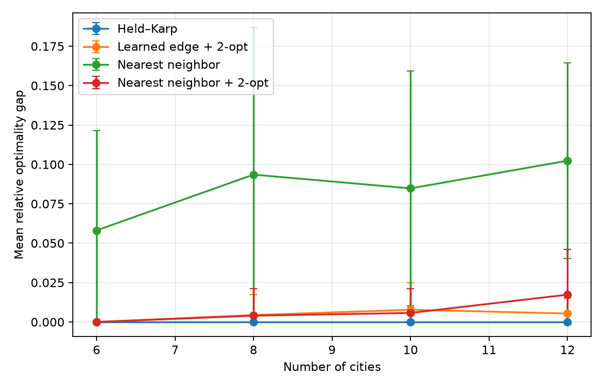
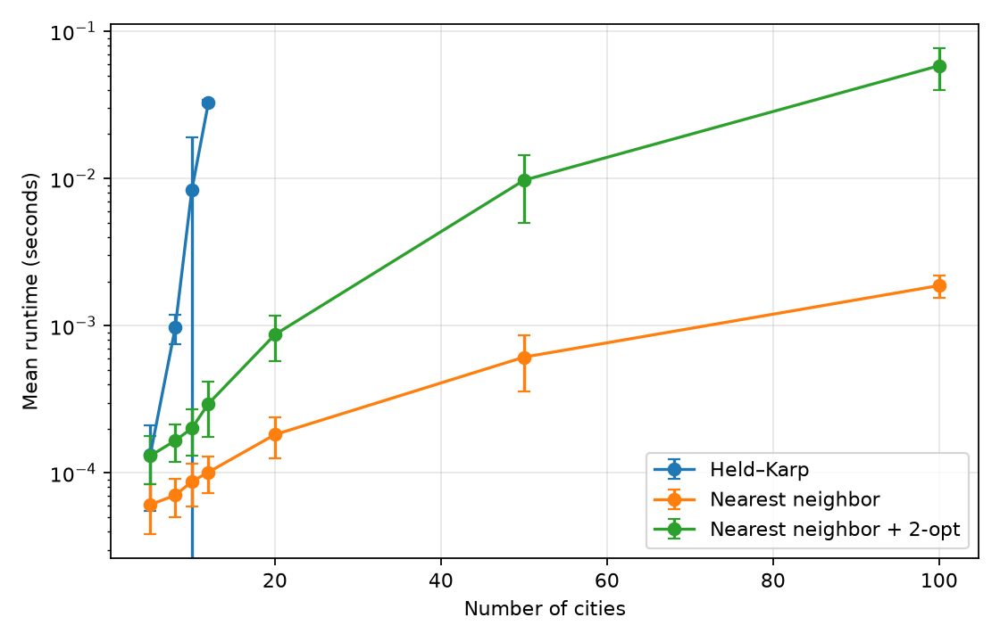
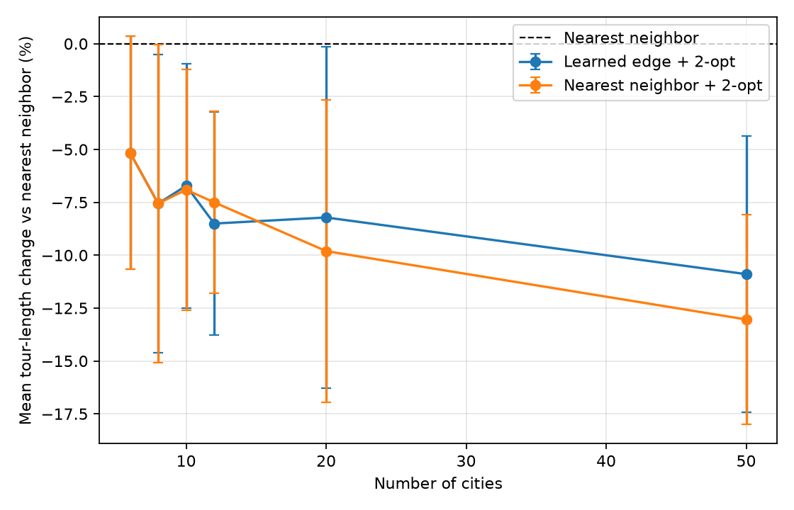

# Learning-Augmented TSP

Learning-Augmented TSP is a reproducible framework for studying when learned
signals improve transparent algorithmic decisions for the symmetric Euclidean
traveling salesperson problem. Exact optimization, classical heuristics, a small
supervised edge scorer, and online algorithm selection share compatible solver
interfaces and are evaluated on identical seeded instances.

The project is educational and research-oriented. It does not claim a novel
algorithm or state-of-the-art performance.



## Results at a glance

The table reports held-out uniform Euclidean instances from seeds 200–219. Each
entry summarizes 20 instances, and gaps use a true Held–Karp optimum.

| Cities | Solver | Mean gap | Median gap | Mean runtime |
|---:|:---|---:|---:|---:|
| 8 | Nearest neighbor | 9.350% | 5.459% | 0.077 ms |
| 8 | Nearest neighbor + 2-opt | 0.400% | 0.000% | 0.167 ms |
| 8 | Learned edge + 2-opt | 0.439% | 0.000% | 0.727 ms |
| 10 | Nearest neighbor | 8.478% | 7.855% | 0.092 ms |
| 10 | Nearest neighbor + 2-opt | 0.574% | 0.000% | 0.192 ms |
| 10 | Learned edge + 2-opt | 0.778% | 0.000% | 0.823 ms |
| 12 | Nearest neighbor | 10.234% | 11.350% | 0.112 ms |
| 12 | Nearest neighbor + 2-opt | 1.732% | 0.000% | 0.270 ms |
| 12 | Learned edge + 2-opt | 0.537% | 0.000% | 0.983 ms |

Measured observations:

- On the separate classical benchmark (seeds 0–19), 2-opt reduced the
  size-averaged mean gap over 5, 8, 10, and 12 cities from 9.91% for nearest
  neighbor to 0.39%.
- On held-out seeds 200–219, learned edge scoring followed by 2-opt was close to
  the classical post-processed baseline. It was slightly worse at 8 and 10 cities,
  better at 12 cities, and tied to displayed precision at 6 cities.
- Without exact references at 20 and 50 cities, learned edge + 2-opt produced
  mean tours 1.72% and 2.24% longer than nearest neighbor + 2-opt, respectively.
  This is a negative result for the current local feature set, not evidence about
  learned TSP methods generally.
- In the 20-round online run, Hedge moved 90.1% of its final probability to
  nearest neighbor + 2-opt. The feedback is full information: every expert runs
  on every round.

Error bars in the figures are population standard deviations across the 20
predeclared seeds. Runtime is wall-clock time on one CPU environment and should
be interpreted as implementation-level evidence, not a hardware-independent
benchmark.





Compact source tables are available in
[`docs/results/`](docs/results/), and the full protocol and interpretation are in
the [experimental report](docs/REPORT.md).

## Supported problem

For city coordinates $x_0,\ldots,x_{n-1}\in\mathbb{R}^2$, the project uses the
symmetric distance $d(i,j)=\lVert x_i-x_j\rVert_2$. A tour is a permutation
$\pi$ of the city indices; the closing edge is implicit:

```math
L(\pi)=\sum_{k=0}^{n-1}d\bigl(\pi_k,\pi_{(k+1)\bmod n}\bigr).
```

Coordinates must be finite two-dimensional values. Asymmetric costs, vehicle
routing, time windows, capacities, and large-scale exact optimization are outside
the current scope.

## Methods

- **Held–Karp** computes and reconstructs exact tours for small instances in
  $O(n^2 2^n)$ time and $O(n2^n)$ space.
- **Nearest neighbor** is a deterministic constructive baseline with optional
  best-of-all-starts evaluation.
- **2-opt** performs deterministic first-improvement local search, independently
  or as post-processing for another solver.
- **Learned edge scoring** trains a compact PyTorch multilayer perceptron on edge
  labels from exact tours. Greedy decoding is optionally followed by 2-opt.
- **Hedge selection** maintains a probability distribution over complete solver
  experts using normalized, full-information losses.

## Experimental setup

- Classical evaluation: sizes 5, 8, 10, 12, 20, 50, and 100; seeds 0–19.
- Model training: sizes 5–9; seeds 100–109; 150 epochs; training seed 42;
  learning rate 0.01; hidden dimension 32.
- Learned evaluation: sizes 6, 8, 10, 12, 20, and 50; seeds 200–219.
- Online evaluation: 20-city instances; seeds 300–319; learning rate 0.5.
- Exact gaps are reported only through 12 cities, where Held–Karp supplies the
  reference optimum.

Training, learned evaluation, and online seeds are disjoint. The model artifact
also records training-instance identifiers and rejects known overlap.

## Reproducible experiments

Run the classical benchmark and summary:

```bash
tsp-learning benchmark \
  --sizes 5,8,10,12,20,50,100 \
  --seeds 0,1,2,3,4,5,6,7,8,9,10,11,12,13,14,15,16,17,18,19 \
  --exact-max-cities 12 \
  --output artifacts/classical-benchmark.csv

tsp-learning summarize \
  --input artifacts/classical-benchmark.csv \
  --output docs/results/classical-summary.csv
```

Train once and evaluate on held-out seeds:

```bash
tsp-learning train \
  --sizes 5,6,7,8,9 \
  --seeds 100,101,102,103,104,105,106,107,108,109 \
  --epochs 150 \
  --training-seed 42 \
  --output artifacts/edge-model.pt

tsp-learning benchmark \
  --sizes 6,8,10,12,20,50 \
  --seeds 200,201,202,203,204,205,206,207,208,209,210,211,212,213,214,215,216,217,218,219 \
  --exact-max-cities 12 \
  --model artifacts/edge-model.pt \
  --output artifacts/learned-benchmark.csv

tsp-learning summarize \
  --input artifacts/learned-benchmark.csv \
  --output docs/results/learned-summary.csv
```

Run and summarize the online experiment:

```bash
tsp-learning online \
  --cities 20 \
  --seeds 300,301,302,303,304,305,306,307,308,309,310,311,312,313,314,315,316,317,318,319 \
  --learning-rate 0.5 \
  --output artifacts/hedge-results.csv

tsp-learning summarize-online \
  --input artifacts/hedge-results.csv \
  --output docs/results/hedge-summary.csv
```

Regenerate the committed figures from raw artifacts:

```bash
tsp-learning plot \
  --input artifacts/learned-benchmark.csv \
  --classical-input artifacts/classical-benchmark.csv \
  --online-input artifacts/hedge-results.csv \
  --model artifacts/edge-model.pt \
  --tour-cities 10 \
  --tour-seed 200 \
  --output-dir docs/assets
```

Raw CSVs and model artifacts remain under ignored `artifacts/`; only compact
summaries and selected figures are versioned.

## Architecture

```text
src/tsp_learning/
├── problem.py, distance.py, route.py, result.py
├── solvers/
│   ├── exact/held_karp.py
│   ├── heuristics/{nearest_neighbor,two_opt}.py
│   └── learning/{features,model,solver,training}.py
├── experiments/{benchmark,summary,online}.py
├── instances/synthetic.py
├── online/hedge.py
├── visualization.py
└── cli.py
```

`TSPInstance`, `SolveResult`, and the structural `Solver` protocol form the small
domain layer. Experiment code depends on that interface rather than individual
solver implementations.

## Installation

Python 3.12 is the primary target.

```bash
python3.12 -m venv .venv
source .venv/bin/activate
python -m pip install --upgrade pip
python -m pip install -e ".[dev]"
```

NumPy and PyTorch are the core dependencies. Matplotlib is optional through
`.[plot]` and included in `.[dev]`. The experiments do not require pandas,
Gymnasium, or tqdm.

## Quick start

```bash
tsp-learning solve --cities 9 --seed 7 --solver nearest-neighbor-2opt
python examples/quickstart.py
```

Run `tsp-learning <command> --help` for all options.

## Quality

```bash
ruff check .
mypy src
pytest --cov=tsp_learning --cov-report=term-missing
```

CI runs these checks on Python 3.12 without a GPU. Exact-solver tests compare
Held–Karp with exhaustive search on independent tiny instances.

## Limitations and further work

The measurements use one synthetic uniform Euclidean distribution, one small
model architecture, twenty evaluation seeds per condition, and no broad
hyperparameter search. Exact labels restrict training sizes; local pair features
omit partial-tour state; and runtime depends on the execution environment.

Useful next steps include TSPLIB evaluation, repeated train/test splits, stronger
constructive baselines, state-aware learned guidance, uncertainty calibration,
and partial-information online selection. These are directions, not current
capabilities.

## License

This project is available under the MIT License.
