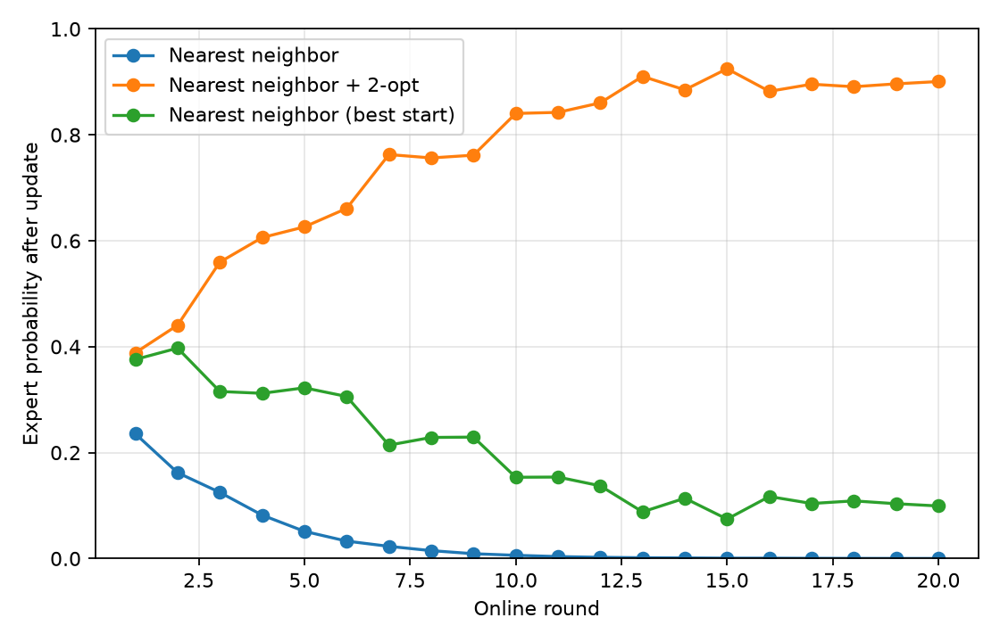
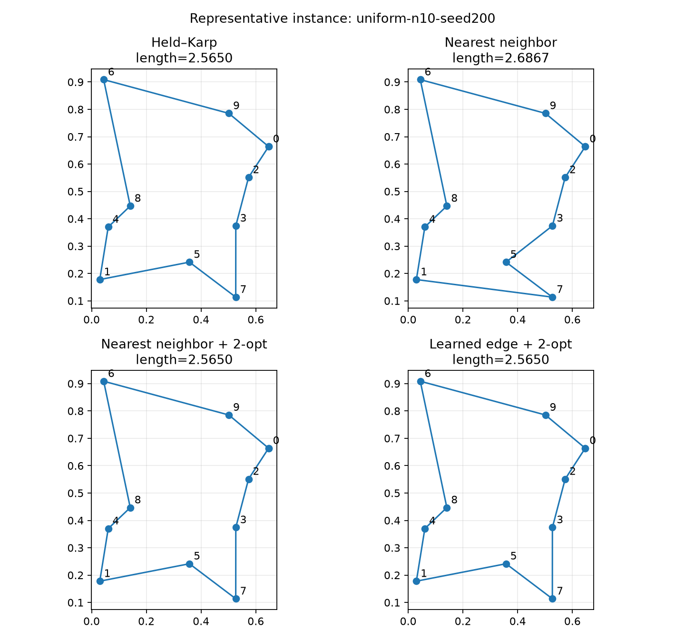

# Experimental Report: Learning-Augmented Euclidean TSP

## 1. Scope and research question

This project studies how exact optimization, classical heuristics, a supervised
edge signal, and online algorithm selection interact on the symmetric Euclidean
traveling salesperson problem (TSP). The primary question is whether a compact
learned edge score trained on small exact instances can improve constructive
decisions or complement 2-opt on held-out instances.

The study is deliberately modest. It evaluates one synthetic distribution, one
learned architecture, and predeclared seed sets. It does not establish a novel
algorithm, broad generalization, or state-of-the-art performance.

## 2. Problem formulation

An instance contains points $V=\{0,\ldots,n-1\}$ with coordinates
$x_i\in\mathbb{R}^2$. The complete undirected graph has symmetric costs:

```math
d_{ij}=\lVert x_i-x_j\rVert_2=d_{ji}.
```

For a permutation $\pi$, the objective is the closed-tour length:

```math
L(\pi)=\sum_{k=0}^{n-1}d_{\pi_k,\pi_{(k+1)\bmod n}}.
```

The stored tour lists every vertex exactly once. The return from the final vertex
to $\pi_0$ is implicit and is included whenever length is measured.

## 3. Algorithms

### 3.1 Held–Karp exact dynamic programming

Fix a start vertex $s$. For $S\subseteq V\setminus\{s\}$ and $j\in S$, define
$C(S,j)$ as the minimum cost of a path from $s$ through exactly $S$ and ending
at $j$. The base case is:

```math
C(\{j\},j)=d_{sj}.
```

The recurrence is:

```math
C(S,j)=\min_{i\in S\setminus\{j\}}
\left[C(S\setminus\{j\},i)+d_{ij}\right].
```

The optimal closed-tour cost is:

```math
L^*=\min_{j\ne s}\left[C(V\setminus\{s\},j)+d_{js}\right].
```

Stored predecessors reconstruct an optimal permutation. The implementation uses
$O(n^2 2^n)$ time and $O(n2^n)$ space and is therefore restricted to small
instances. Here it supplies ground truth and training labels through 12 cities.

### 3.2 Nearest neighbor

From a chosen start, nearest neighbor repeatedly appends the closest unvisited
city. Equal distances are broken by city index, making the construction
deterministic. An optional expert checks every starting city and returns the
shortest resulting tour. Dense-distance construction takes $O(n^2)$ time.

### 3.3 2-opt

Given tour edges $(a,b)$ and $(c,d)$, a 2-opt move removes them, reverses the
segment from $b$ through $c$, and inserts $(a,c)$ and $(b,d)$. Its local change is:

```math
\Delta=d_{ac}+d_{bd}-d_{ab}-d_{cd}.
```

The implementation accepts a move only when $\Delta$ is below a numerical
tolerance, uses first improvement, and repeats until no improving move remains.
The returned length is checked against the initial solver result.

### 3.4 Learned edge scoring

Each training instance is solved exactly. An undirected pair receives label 1 if
it occurs in the optimal cycle and 0 otherwise. Five features describe a pair:

1. absolute horizontal coordinate difference;
2. absolute vertical coordinate difference;
3. Euclidean separation;
4. smaller endpoint radius from the instance centroid;
5. larger endpoint radius from the instance centroid.

Coordinates are centered and divided by the root-mean-square radius. The
features are invariant to translation and uniform scaling, and sorting endpoint
radii preserves undirected symmetry.

A two-hidden-layer multilayer perceptron produces one edge logit. Training uses
weighted binary cross-entropy and Adam in a deterministic full-batch CPU loop.
At inference, the decoder repeatedly chooses the unvisited city with the highest
logit, with Euclidean distance and city index as tie breakers. The reported
learned baseline applies the same 2-opt post-processing as the classical
pipeline.

Training and evaluation are separate operations. Saved artifacts record training
instance names, and the solver rejects known overlap. The training and evaluation
seed sets below are also disjoint.

### 3.5 Hedge algorithm selection

Each expert is a complete TSP solver. On round $t$, all expert tour lengths are
observed, so the feedback setting is full information. Costs are normalized
within the round:

```math
\ell_{t,i}=
\begin{cases}
0, & \max_j L_{t,j}=\min_j L_{t,j},\\
\dfrac{L_{t,i}-\min_j L_{t,j}}
{\max_j L_{t,j}-\min_j L_{t,j}}, & \text{otherwise}.
\end{cases}
```

With learning rate $\eta>0$, weights and probabilities update as:

```math
w_{t+1,i}=w_{t,i}\exp(-\eta\ell_{t,i}),
\qquad
p_{t+1,i}=\frac{w_{t+1,i}}{\sum_jw_{t+1,j}}.
```

The selected expert is the current maximum-probability expert, with declaration
order breaking ties. This deterministic action rule and the per-instance loss
normalization differ from a sampled textbook presentation, so no new regret
claim is made.

## 4. Experimental protocol

### 4.1 Instance generation

All instances use `numpy.random.default_rng(seed)` to draw coordinates uniformly
from $[0,1)^2$. Every solver in a benchmark receives the same immutable instance.

### 4.2 Classical benchmark

- Sizes: 5, 8, 10, 12, 20, 50, 100.
- Seeds: 0–19.
- Solvers: Held–Karp where eligible, nearest neighbor, nearest neighbor + 2-opt.
- Exact threshold: 12 cities.
- Raw records: 360.

The planned setup ran without adjustment.

### 4.3 Model training

- Sizes: 5, 6, 7, 8, 9.
- Instance seeds: 100–109, producing 50 training instances.
- Epochs: 150.
- Training seed: 42.
- Learning rate: 0.01.
- Hidden dimension: 32 units per hidden layer.
- Final weighted training loss: 0.573256.
- Device: CPU.

The seed set and hyperparameters were fixed before evaluation and were not
changed after observing held-out results.

### 4.4 Learned-method evaluation

- Sizes: 6, 8, 10, 12, 20, 50.
- Seeds: 200–219.
- Solvers: Held–Karp where eligible, nearest neighbor, nearest neighbor + 2-opt,
  learned edge + 2-opt.
- Exact threshold: 12 cities.
- Raw records: 440.

Training and evaluation seeds have an empty intersection.

### 4.5 Online evaluation

- Size: 20 cities.
- Seeds and round order: 300–319.
- Experts: nearest neighbor, best-start nearest neighbor, nearest neighbor +
  2-opt.
- Learning rate: 0.5.
- Rounds: 20.

### 4.6 Metrics and summaries

When an exact reference is available, relative optimality gap is:

```math
\operatorname{gap}(L,L^*)=\frac{L-L^*}{L^*}.
```

No gap is reported above the exact threshold. Solver-reported lengths are
independently recomputed from their tours before benchmark records are accepted.
Summaries group by city count and solver and report counts, means, medians, and
population standard deviations. The figures use population-standard-deviation
error bars across the 20 fixed seeds.

Runtime is wall-clock time and includes Python implementation effects. It is not
a hardware-independent complexity measurement.

## 5. Results

### 5.1 Classical baselines

| Cities | Nearest-neighbor mean gap | NN + 2-opt mean gap |
|---:|---:|---:|
| 5 | 4.037% | 0.035% |
| 8 | 10.358% | 0.460% |
| 10 | 12.526% | 0.376% |
| 12 | 12.706% | 0.673% |

Across these four equally sampled sizes, the average of the per-size mean gaps
was 9.91% for nearest neighbor and 0.39% after 2-opt. Thus 2-opt consistently
improved this constructive baseline on the measured exact-reference instances.


### 5.2 Learned solver

| Cities | NN mean gap | NN + 2-opt mean gap | Learned + 2-opt mean gap |
|---:|---:|---:|---:|
| 6 | 5.811% | 0.000% | 0.000% |
| 8 | 9.350% | 0.400% | 0.439% |
| 10 | 8.478% | 0.574% | 0.778% |
| 12 | 10.234% | 1.732% | 0.537% |

The learned pipeline did not dominate the classical post-processed baseline. It
was slightly worse at 8 and 10 cities, better at 12 cities, and equivalent to
displayed precision at 6 cities. Across the four equally sampled exact sizes,
the mean of per-size mean gaps was approximately 0.44% for learned + 2-opt and
0.68% for nearest neighbor + 2-opt; that aggregate advantage is driven largely
by the 12-city condition and should not be read as broad superiority.

At sizes without exact references, learned + 2-opt improved substantially over
plain nearest neighbor but was worse than nearest neighbor + 2-opt: mean tour
length was 1.72% higher at 20 cities and 2.24% higher at 50 cities. The current
pairwise features therefore did not provide a consistent improvement over the
stronger classical pipeline.


### 5.3 Runtime scaling

Selected mean wall-clock runtimes were:

| Solver | 5 cities | 12 cities | 50 cities | 100 cities |
|:---|---:|---:|---:|---:|
| Held–Karp | 0.133 ms | 32.805 ms | — | — |
| Nearest neighbor | 0.061 ms | 0.101 ms | 0.612 ms | 1.873 ms |
| Nearest neighbor + 2-opt | 0.131 ms | 0.295 ms | 9.724 ms | 58.319 ms |

Held–Karp runtime increased by about 247 times from 5 to 12 cities in this
implementation. This illustrates the expected exponential trend but is not a
formal empirical complexity estimate. The heuristic runs extend to 100 cities;
2-opt pays additional local-search cost for shorter tours.


### 5.4 Online Hedge behavior

| Expert | Selected rounds | Mean loss | Cumulative loss | Final probability |
|:---|---:|---:|---:|---:|
| Nearest neighbor | 1 | 1.000 | 20.000 | 0.010% |
| Best-start nearest neighbor | 0 | 0.312 | 6.231 | 9.925% |
| Nearest neighbor + 2-opt | 19 | 0.091 | 1.820 | 90.064% |

The selector began uniformly, chose ordinary nearest neighbor on the tie-broken
first round, and then selected nearest neighbor + 2-opt for the remaining 19
rounds. Its posterior concentrated on that expert while retaining some mass on
best-start nearest neighbor. Because every expert was executed on every round,
this result concerns full-information adaptation rather than computational
savings from selective execution.



### 5.5 Representative tour

The figure below uses the first held-out 10-city evaluation instance
(`uniform-n10-seed200`), chosen by protocol position rather than outcome. It is
an illustration, not aggregate evidence. On this instance, both post-processed
methods reached the exact length while the constructive nearest-neighbor tour
was longer.



## 6. Interpretation

### Measured result

2-opt provided the clearest and most consistent improvement. The learned edge
score was competitive after the same post-processing but did not consistently
beat it. Hedge rapidly favored the expert with the lowest cumulative normalized
loss on the chosen sequence.

### Possible interpretation

The local symmetric pair features may contain useful geometric information but
omit the partial-tour state and global constraints needed for consistently
better construction. The 2-opt stage can also erase many differences between
constructive policies. These are plausible explanations, not causal conclusions;
isolating them requires ablations, multiple train/test splits, and additional
instance distributions.

## 7. Threats to validity

- **Synthetic distribution:** all points are uniform in the unit square; clustered,
  structured, and real benchmark instances may behave differently.
- **Limited training sizes:** exact labels restrict supervised training to small
  TSPs, while evaluation extends beyond the training range.
- **Single architecture:** one small multilayer perceptron and one feature set were
  tested; no architecture-level conclusion follows.
- **Limited hyperparameter exploration:** the reported configuration was not
  compared with a systematic search.
- **Sample count:** twenty seeds per condition support descriptive summaries but
  not a claim of statistical significance or broad generalization.
- **No external corpus:** TSPLIB and other established benchmark collections were
  not evaluated.
- **Feature locality:** pair geometry does not encode the current partial tour or
  global feasibility structure.
- **Runtime environment:** timings depend on Python, libraries, operating system,
  background load, and hardware. Very short timings are especially noisy.
- **Post-processing interaction:** using 2-opt for both learned and classical
  constructions can compress differences between the initial tours.
- **Online feedback:** Hedge evaluates all experts and uses within-round normalized
  losses, so the result is not a bandit-feedback or compute-saving experiment.

## 8. Reproducibility

The experiments used:

- base Git revision `b4c2119f6f8fcff9099d54635168d2d8e797b330`;
- Python 3.12.3;
- NumPy 2.5.3;
- PyTorch 2.14.0+cu130 with CUDA unavailable;
- CPU-only execution on x86-64 Linux under WSL2.

Experiment and reporting code was modified in the working tree after the base
revision; the final review should commit those changes together. Exact commands
are recorded in the README. Raw benchmarks and the model remain in ignored
`artifacts/`, while compact summaries in `docs/results/` and selected figures in
`docs/assets/` are intended for version control.

## 9. Verification strategy

Tests cover domain validation, deterministic generation, Held–Karp against
exhaustive search, cyclic 2-opt behavior, solver result validation, benchmark and
summary CSV semantics, training reproducibility, artifact loading, overlap
rejection, online probability updates, and CLI workflows. Static checks use Ruff
and strict mypy; CI runs on Python 3.12 without a GPU.

Coverage is diagnostic rather than a target: new tests are selected for behavioral
value, not solely to increase a percentage.

## 10. Limitations and future work

Promising extensions include repeated train/test splits, clustered and TSPLIB
instances, stronger constructive baselines, feature ablations, calibrated
uncertainty, state-aware neural policies, and partial-information online
selection. Those extensions should be evaluated with predeclared protocols and
reported only after reproducible measurement.

## References

- R. Bellman, “Dynamic Programming Treatment of the Travelling Salesman
  Problem,” *Journal of the ACM*, 9(1), 61–63, 1962.
- M. Held and R. M. Karp, “A Dynamic Programming Approach to Sequencing
  Problems,” *Journal of the Society for Industrial and Applied Mathematics*,
  10(1), 196–210, 1962.
- G. A. Croes, “A Method for Solving Traveling-Salesman Problems,” *Operations
  Research*, 6(6), 791–812, 1958.
- Y. Freund and R. E. Schapire, “A Decision-Theoretic Generalization of On-Line
  Learning and an Application to Boosting,” *Journal of Computer and System
  Sciences*, 55(1), 119–139, 1997.
